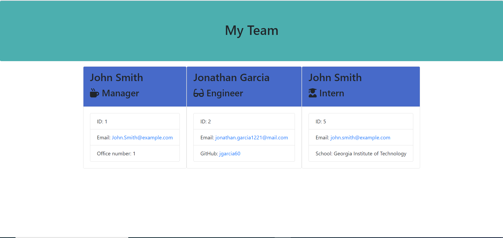

# team-profile-generator

## Description 

This project designed a work team profile from a command line interface. This project uses the node "Inquirer" package to prompt the user for questions to create employee objects, which are then used to write to an html file. 

The necessary classes and objects were created by test driven development. Jest test files were used to develop the correct constructors for extensions of the Employee object.

Code abstraction was also practiced to implement several methods for adding different employees to your team profile. 

## Table of Contents 

* [Installation](#installation)
* [Usage](#usage)
* [Credits](#credits)
* [License](#license)

## Installation

Here is the link to the webpage:

https://jgarcia60.github.io/team-profile-generator

To install the project files, you can clone the "team-profile-generator" repository which contains the necessary files at https://github.com/jgarcia60/team-profile-generator by clicking the green drop down "Code" and cloning the repo with an SSH key. To run the command line interface app, you will need to run "node app.js" in the correct directory in your terminal. Then your created team profile html will be generated in the "output" folder.

## Usage 

You may use this code to learn about using the Inquirer npm package to create a command line interface application, or as a tool to learn about using node.js, creating and extending object classes, and writing files, and learning how to use jest for test driven development.

This is what it looks like:

## Credits

The app.js, style.css, and .js files in the lib folder were solely developed by Jonathan Garcia (https://github.com/jgarcia60/). The testing files and htmlRenderer.js file were provided by Trinity Education Services, LLC.

## License

MIT License

Copyright (c) [2020] [Jonathan Garcia]

Permission is hereby granted, free of charge, to any person obtaining a copy
of this software and associated documentation files (the "Software"), to deal
in the Software without restriction, including without limitation the rights
to use, copy, modify, merge, publish, distribute, sublicense, and/or sell
copies of the Software, and to permit persons to whom the Software is
furnished to do so, subject to the following conditions:
The above copyright notice and this permission notice shall be included in all
copies or substantial portions of the Software.

THE SOFTWARE IS PROVIDED "AS IS", WITHOUT WARRANTY OF ANY KIND, EXPRESS OR
IMPLIED, INCLUDING BUT NOT LIMITED TO THE WARRANTIES OF MERCHANTABILITY,
FITNESS FOR A PARTICULAR PURPOSE AND NONINFRINGEMENT. IN NO EVENT SHALL THE
AUTHORS OR COPYRIGHT HOLDERS BE LIABLE FOR ANY CLAIM, DAMAGES OR OTHER
LIABILITY, WHETHER IN AN ACTION OF CONTRACT, TORT OR OTHERWISE, ARISING FROM,
OUT OF OR IN CONNECTION WITH THE SOFTWARE OR THE USE OR OTHER DEALINGS IN THE
SOFTWARE.

---